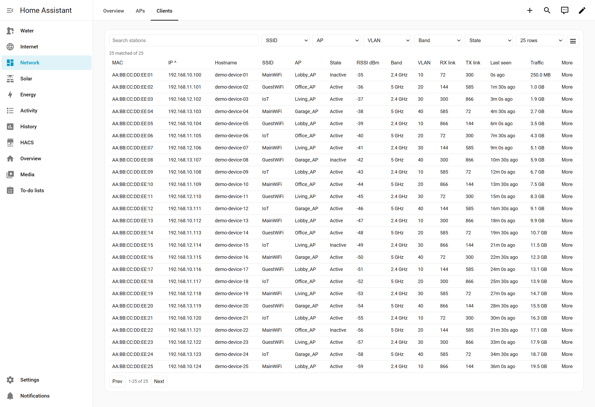
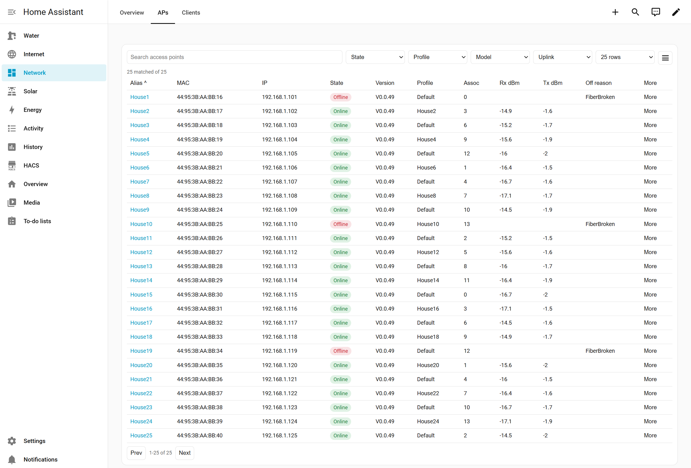
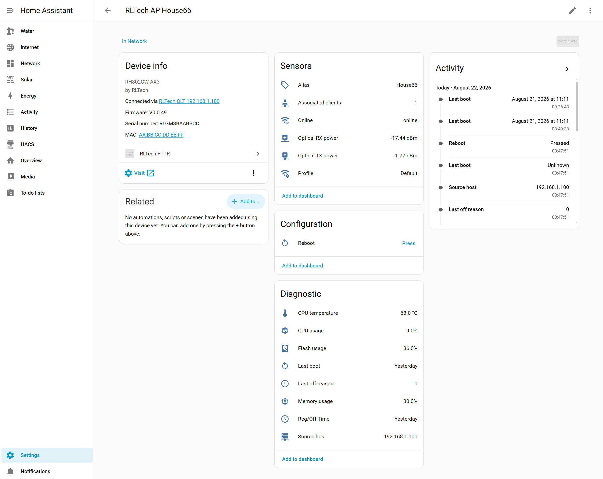
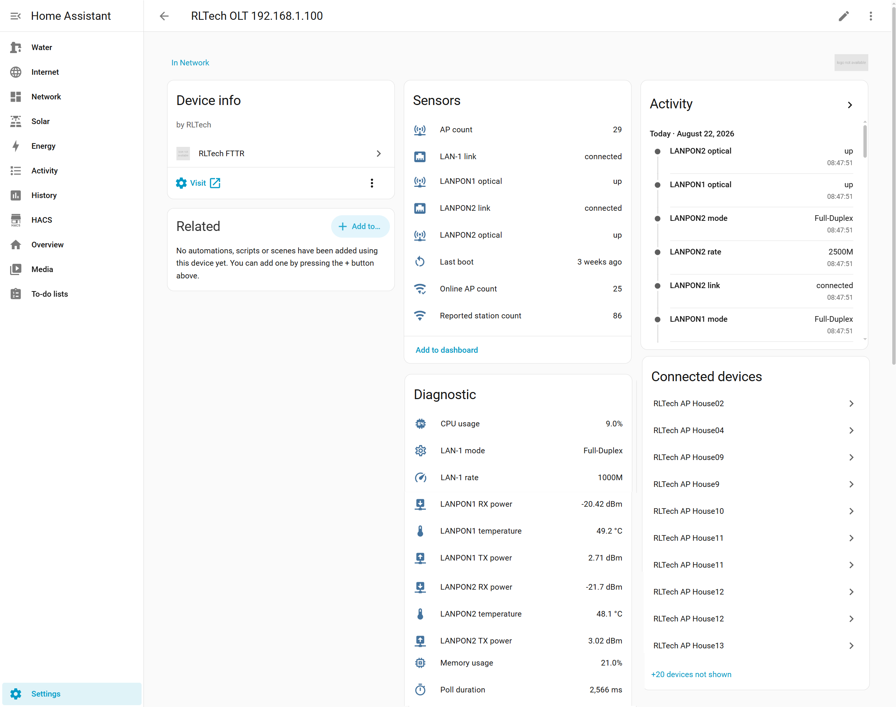

# RLTech FTTR Home Assistant integration

Custom integration for RLTech OLT/FTTR Web UI inventory data.

Requires Home Assistant `2026.3.0` or newer.

The integration reads two RLTech Web UI planes:

- Port `8080` for FTTR AP and Wi-Fi station inventory.
- Port `80` for OLT hardware, LAN/LAN-PON, and ONU optical status.
- Optional local MQTT on port `8883` for faster station and AP health updates
  between HTTP polls.

RLTech Web UIs generally allow only one HTTP login session at a time. The
integration logs out immediately after each poll so sessions are not kept open,
but polling can only run while no administrator is logged into the same device
Web UI.

## Features

- Adds the RLTech OLT/controller as a Home Assistant device with aggregate
  status sensors.
- Adds each managed FTTR AP as its own Home Assistant device, using the AP
  serial number as the stable device/entity identity.
- Tracks AP online state, profile, alias, associated-client count, optical
  TX/RX power, and ONU source host.
- Adds a Home Assistant reboot button for each AP when AP credentials are
  configured.
- Polls port `80` OLT hardware data for CPU usage, memory usage, runtime,
  LAN/LAN-PON link state, and LAN-PON optical module values.
- Supports additional port `80` OLT hosts for downstream/slave OLTs so ONU
  optical rows can enrich APs connected behind those devices.
- Keeps Wi-Fi stations as an in-memory inventory instead of creating hundreds
  of Home Assistant tracker entities.
- Provides a bundled station table card with search, filters, sorting,
  pagination, mobile layout, hostname enrichment, MAC vendor lookup, and
  readable traffic totals.
- Provides a bundled AP table card with search, filters, sorting, pagination,
  mobile layout, device links, and AP detail fields.
- Optionally uses the RLTech local MQTT broker as a live overlay for fresher
  station rows and known-AP health/online updates between HTTP polls.
- Preserves last known inventory data on temporary poll failures or busy Web UI
  sessions instead of clearing the tables immediately.

## Screenshots

### Station Table



### Access Point Table



### Access Point Device



### OLT Device



## HACS install

This repository can be installed with HACS as a custom integration.

1. Open HACS in Home Assistant.
2. Open the three-dot menu and choose **Custom repositories**.
3. Add this repository URL:

   ```text
   https://github.com/hmsta/ha-rltech-fttr
   ```

4. Select **Integration** as the category.
5. Install **RLTech FTTR** from HACS.
6. Restart Home Assistant.
7. Add the integration from **Settings > Devices & services**.

HACS installs the integration files, including the bundled table card
JavaScript. For the normal Home Assistant storage-mode dashboard setup, the
integration registers the bundled card resources automatically when it starts.

If your Home Assistant Lovelace resources are configured in YAML mode, add
these dashboard resources manually after the integration is installed:

```text
/rltech_fttr/rltech-fttr-station-table-card.js
/rltech_fttr/rltech-fttr-ap-table-card.js
```

Resource type: JavaScript module.

## Manual install

Copy `custom_components/rltech_fttr` into Home Assistant's
`custom_components` directory and restart Home Assistant.

## Configure

Add the integration from **Settings > Devices & services**.

### Main OLT

Enter the OLT IP address or hostname, for example `192.168.1.1`. Do not include
a port. The integration automatically uses:

- `http://<host>` for port `80` hardware and optical status.
- `http://<host>:8080` for FTTR AP and station inventory.
- `<host>:8883` for optional MQTT live updates.

The OLT serves plain HTTP in the observed deployment. Use this only on a trusted
management network or VPN.

### Login Credentials

The setup flow asks for separate credentials because RLTech exposes different
interfaces:

- Port `80` credentials for OLT hardware, LAN/LAN-PON, and ONU optical status.
- Port `8080` credentials for FTTR AP and station inventory.
- AP credentials for direct AP actions, such as rebooting an AP from Home
  Assistant.

RLTech Web UIs usually allow only one login at a time. If you log into an OLT
or AP Web UI manually to change configuration, use the Web UI logout button
when you are done. Closing the browser tab may leave the session active until
the device times it out. During that time the integration preserves last known
data instead of polling through the busy login.

The AP reboot button logs into the AP directly at `http://<ap-ip>` with the
configured AP credentials. It does not log out after a successful reboot request
because the AP Web UI is expected to restart.

### Polling Options

- Scan interval, default `60` seconds.
- Station retention, default `3600` seconds. Inactive station rows are kept for
  this long before they disappear from the station table.
- AP inventory polling, enabled by default.
- Station inventory polling, enabled by default.
- Hardware and ONU status polling, enabled by default.

### Additional OLT Hosts

If some APs are physically connected behind downstream/slave OLTs, add those
extra port `80` hosts in **Additional port 80 OLT hosts**. Separate multiple
hosts with commas, spaces, or new lines.

Additional OLT hosts are shown as separate OLT hardware devices and can enrich
the AP table with ONU optical rows for APs connected behind them.

### MQTT Live Overlay

MQTT is optional and disabled by default. When enabled, the integration connects
to the same OLT host on fixed port `8883`. Home Assistant's MQTT integration is
not required.

Use MQTT when you want station rows and known-AP health/status to update faster
between normal HTTP polls. Leave it disabled if HTTP polling is enough.

### AP Area

Optionally choose a Home Assistant area for newly created AP devices. Existing
AP devices keep their current area.

## What Gets Added To Home Assistant

### OLT Devices

- One OLT/controller device for the configured main OLT.
- One additional OLT hardware device for each configured additional port `80`
  host.
- OLT sensors for aggregate status, CPU usage, memory usage, runtime, LAN port
  state, and LAN-PON optical values where available.

### AP Devices

- One Home Assistant device per managed AP that has an `SN`.
- AP device and entity IDs are based on the AP serial number, not the AP alias.
- AP entities include online state, associated-client count, profile, alias,
  optical TX/RX power, ONU source host, and a reboot button where available.
- AP rows without an `SN` remain visible in the AP table but do not create Home
  Assistant devices.

### Wi-Fi Stations

Wi-Fi stations are not created as Home Assistant devices or trackers. They are
kept as in-memory inventory rows for the station table. This avoids hundreds of
volatile client entities and unnecessary recorder history.

The integration still exposes aggregate station sensors, including reported
station count, so you can chart overall client count or alert on unusual
changes.

Station hostnames can be enriched from Home Assistant's DHCP discovery cache
when the RLTech station row has no useful hostname. Station rows also include a
best-effort MAC vendor column from the local `aiooui` OUI database installed
with the integration. Both lookups are local and do not create station entities.

### Dashboard Cards

The integration bundles two Lovelace cards:

- Station table card for Wi-Fi client lookup.
- AP table card for managed AP inventory and AP details.

## MQTT live overlay

MQTT is optional. It complements HTTP polling and does not replace it.

- HTTP remains the authority for AP inventory, station baseline, OLT status,
  LAN/LAN-PON status, and ONU optical TX/RX.
- MQTT can make station rows fresher between HTTP polls.
- MQTT can update known AP associated-client count, CPU usage, CPU temperature,
  memory usage, flash usage, last boot, and online state.
- Unknown AP MQTT messages are ignored. AP discovery still comes from HTTP.
- The Lovelace cards do not redraw on every MQTT message. The station card can
  refresh a narrowed view with debounce/throttling when station data changes.

If MQTT is unavailable or misconfigured, the integration continues to work with
HTTP polling only.

## Station table card

Add a station card:

```yaml
type: custom:rltech-fttr-station-table-card
```

The card reads the latest coordinator data through the integration websocket
API and supports search, sort, and filters for SSID, AP, VLAN, band, and active
state. A station is `Active` when it appears in the latest successful station
poll, and `Inactive` while it is retained from an earlier poll. Inactive rows
expire after the configured station retention window.

The visible columns, mobile columns, page size, sort order, and filters can be
changed in the card's table options menu. By default those UI preferences are
remembered in the current browser's local storage. Search text is intentionally
not remembered. On phone-sized screens the card switches from a wide table to a
compact row layout using `mobile_columns`.

## AP table card

Add an AP inventory card:

```yaml
type: custom:rltech-fttr-ap-table-card
```

The AP card uses the same websocket pattern and supports search, sort, and
filters for online state, profile, model, and uplink. It shows AP inventory
fields such as alias, MAC, IP, firmware, association count, uplink, serial
number, and ONU optical/status details when hardware status polling is enabled.

Source ownership is intentionally strict:

- Port `8080` provides AP inventory and station inventory.
- Port `80` provides OLT runtime/CPU/memory, LAN/LAN-PON status, and ONU/AP
  optical/status rows.
- The first port `80` source is the master OLT hardware device. Additional
  port `80` hosts are represented as separate OLT hardware devices.
- AP optical/status rows from port `80` are joined to AP inventory by AP serial
  number, not alias, MAC, or IP.
- `Reg/Off Time` is parsed as a timestamp using Home Assistant's local time
  zone. For online ONUs it appears to be registration time; for offline ONUs it
  appears to be off time.

The AP table receives the current HA entity IDs from Home Assistant's entity
registry; clicking AP-backed cells such as alias, state, profile, or associated
station count opens the normal HA more-info/history dialog. Other AP fields,
including channels, uplink details, ONU interface, and source OLT host, remain
inventory-only table data.

Both table cards accept:

```yaml
entry_id: optional_config_entry_id
page_size: 25
mobile_page_size: 10
page_size_options:
  - 25
  - 50
  - 100
remember_preferences: true
storage_key: optional_unique_key
columns: []
mobile_columns: []
```

When exactly one RLTech FTTR integration is configured, `entry_id` can be
omitted and the card will select it automatically. Set `entry_id` only when
multiple RLTech FTTR integrations are configured. The visible columns, mobile
columns, and page size have built-in defaults and can be changed from the
card's table options menu.

Use `storage_key` if you place multiple cards for the same config entry on
different dashboards and want separate remembered browser layouts.

The AP table also accepts `default_sort_key` and `default_sort_dir`. By default
APs are sorted by `online` ascending, so offline APs appear first.
